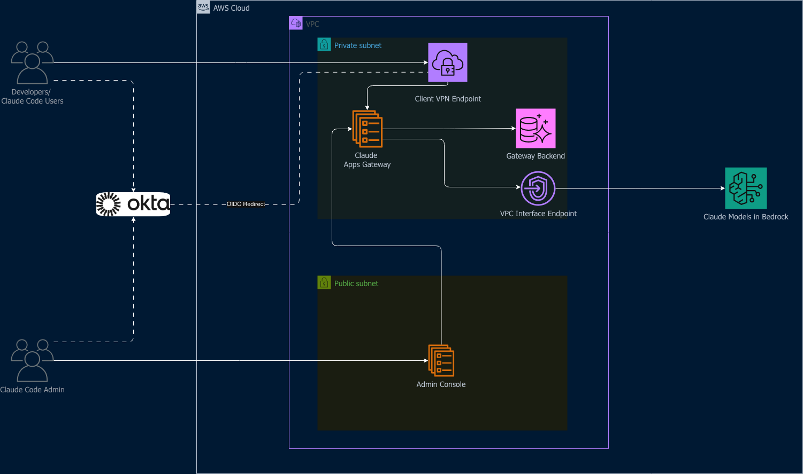
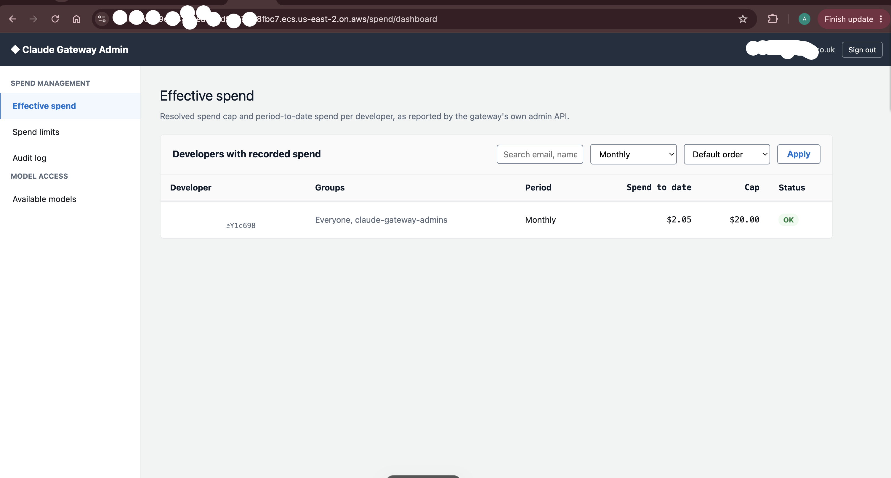
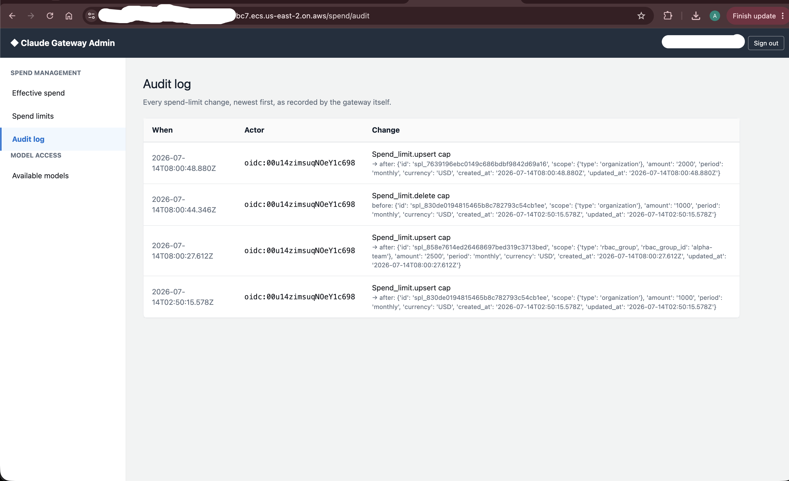
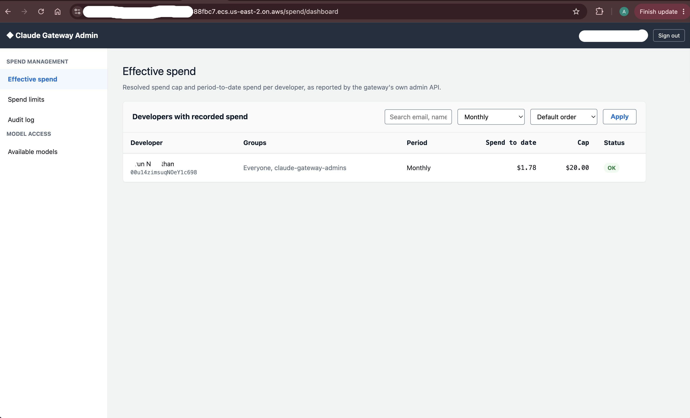

# Claude Apps Gateway on AWS

A complete, deployable reference architecture for running Anthropic's [Claude apps gateway](https://docs.claude.com/en/docs/claude-code/claude-apps-gateway) on AWS, fronting Amazon Bedrock — plus an admin console for spend-limit and model-access management, deployed by default.

Everything here — the container images, the IAM policies, the Okta OIDC integration, the model-access mechanism — was built and proven end to end in a real AWS account before being packaged into this CDK app. It deploys from a clean account to a fully working gateway with one `cdk deploy --all`.

## Architecture

Five CDK stacks, deployed together:

| Stack | Contents |
|---|---|
| `ClaudeGatewayNetworkStack` | A dedicated VPC: 2 private subnets (gateway) + 2 public subnets (admin console), 1 NAT Gateway, VPC interface endpoints for Bedrock and Secrets Manager, and the 3 security groups tying it together. |
| `ClaudeGatewayDatabaseStack` | Aurora Serverless v2 PostgreSQL (auto-pausing, encrypted at rest), with a Lambda-backed Custom Resource that safely derives a single `postgres_url` connection secret from RDS's own auto-managed credentials. |
| `ClaudeGatewaySecretsStack` | Generated secrets for JWT signing, the admin API write key, and console session signing — plus an empty placeholder for the Okta client secret, whose real value you set once after deploying (see [docs/02-deploy.md](docs/02-deploy.md)). |
| `ClaudeGatewayStack` | The gateway itself: `DockerImageAsset`-built container, 3 IAM roles, and an `AWS::ECS::ExpressGatewayService` on the private subnets. |
| `ClaudeGatewayAdminConsoleStack` | The admin console: same pattern, on the public subnets, wired to the gateway's real endpoint automatically. |

The gateway is deliberately private (Express Mode provisions an internal load balancer for it, since its subnets have no direct internet route) — developers reach it only via the CLI's device-flow login. The admin console is deliberately public — it's gated by Okta group membership rather than network placement, so admins don't need VPN access just to manage spend limits.

## What's included

- **The gateway**, containerized with the `claude` binary downloaded and cryptographically verified (GPG signature + SHA256 checksum against Anthropic's published manifest) at Docker build time — no pre-staged binary dependency.
- **The admin console** (FastAPI + server-rendered HTML): an effective-spend dashboard, spend-limit CRUD, and model-access management — showing the live Anthropic model catalog from Bedrock, not a hardcoded list, and applying changes as a plain ECS parameter update with no image rebuild. See [docs/04-admin-console-guide.md](docs/04-admin-console-guide.md) for how this works and its auditability trade-offs.
- **The full CDK app**, using AWS CDK's native `CfnExpressGatewayService` L1 construct — no hand-rolled `AwsCustomResource` needed for the ECS Express Mode service itself.

## Getting started

1. [Prerequisites](docs/01-prerequisites.md) — Okta app registration and what CDK needs from it.
2. [Deploy](docs/02-deploy.md) — the literal `cdk deploy` steps.
3. [Verify](docs/03-verify.md) — confirm the deployment actually works.
4. [Admin console guide](docs/04-admin-console-guide.md) — using spend limits and model access.
5. [Cleanup](docs/05-cleanup.md) — tearing it all down.

## Screenshots

The admin console turns spend control and model access — normally a support ticket, a CLI command, or a redeploy — into something a platform admin manages directly, with every action attributed to their own identity and audited by the gateway itself.

**See exactly who's spending what, in real time.**

**Set a cap in seconds — no ticket, no redeploy, enforced on the very next request.**

**Every change traced to the real admin who made it — not a shared credential.**

**Flip on a new Claude model for your whole org with a checkbox, live from Bedrock's own catalog.**

## Cost note

This deploys billable resources: a NAT Gateway (~$0.045/hr + data processing), an Aurora Serverless v2 cluster (auto-pauses after 30 minutes idle, but isn't free while active), two ECS Express Mode services (each provisions its own Application Load Balancer), and Bedrock inference charges based on actual usage. None of this is covered by AWS Free Tier. Use the [AWS Pricing Calculator](https://calculator.aws/) for an estimate specific to your expected usage, and see [docs/05-cleanup.md](docs/05-cleanup.md) when you're done evaluating it.

## License

This project is licensed under the MIT-0 License — see [LICENSE](LICENSE).
